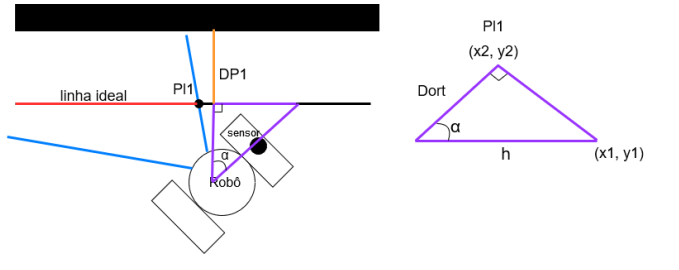
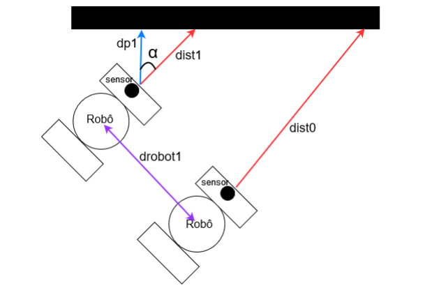

# Mobile Robotics

This project aims to develop a Java application that can control the Lego EV3 robot. The final objective is to create a program in which the robot follows a wall at a distance of 70cm. The robot should have intelligence to adjust itself in order to maintain the 70cm. This is achieved through a Bluetooth library that can control the wheels and their rotation, as well as a proximity sensor. With these basic commands, it is possible to make the robot move in a straight line or in a circle and detect the distance between the robot and the wall to its right. Using those basic operations, along with mathematical operations, mainly with triangles using Pythagorean Theorem, it was possible to develop the program that allows the robot to follow the wall at a distance of 70cm, adjusting itself as necessary.

Example of diagrams that the robot executes are:

<table>
  <tr>
    <td></td>
</tr>
  <tr>
    <td style="text-align: center;"><em>1. Calculus for the ideal line </em></td>
  </tr>
</table>

<table>
  <tr>
    <td></td>
</tr>
  <tr>
    <td style="text-align: center;"><em>2. Calculus of the distance to the wall</em></td>
  </tr>
</table>

